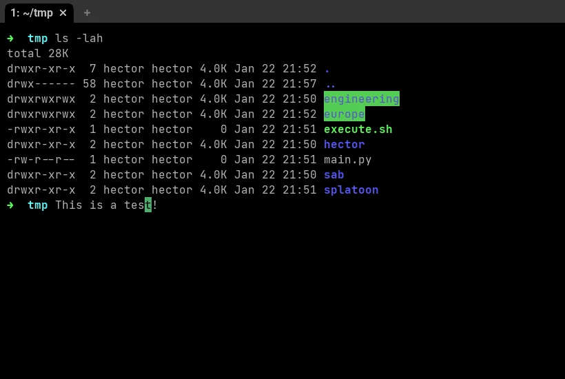

While procrastinating on Reddit, I came across a post talking about a terminal I had never heard before: [wezterm](https://wezfurlong.org/wezterm/index.html). What is cool about it is that it can be configured using lua. What this means is that you can bake some logic into your config and make it behave. So, even though kitty serves me well, I am already looking to replace it full-time on my personal computer.

# What do I need on a terminal?

I am a simple man, if the terminal has ligatures and can change the color scheme on the fly, that's more than enough for me. Now, the screenshot below shows the default experience of wezterm. From it we can see that it has an ok-ish color scheme and tabs, though I am not a fan. So, let's fix it.



## Setting up the config file

Checking out [the documentation](https://wezfurlong.org/wezterm/config/files.html) we can find that there are several ways we can define a config file. One of them is writing the file down to `$HOME/wezterm.lua`. However, we will be doing "more complex" stuff. Thus `$HOME/.config/wezterm/wezterm.lua` will serve us best.

Note that the file is expected to return a table. So, we return an empty one as shown below.

```lua
return {}
```

## Removing Tabs

One thing I don't like about the out-of-the-box experience is that it has tabs. I know that for lots of people that will be great, it is just not for me as I like using tmux for this behavior. To remove the tabs we need to add the following to our `wezterm.lua`. In the video below you can see how it looked before and how it looks after.

```lua
return {
    enable_tab_bar = false,
}
```


## Color Scheme

One pretty neat thing about wezterm is that it has a lot of color schemes, just head to [here](https://wezfurlong.org/wezterm/colorschemes/index.html) to explore all its catalog. There are a few things that I look at when choosing a color scheme:
- background color,
- font color over the background,
- font color when files can be executed,
- clarity of the text when highlighted, as when a folder has 777 permissions,
- and that the characters under the cursor are visible.


In the end, I landed on `Aci (Gogh)`, but it had the problem that the cursor didn't show the characters below it. To solve this I had to create the folder `$HOME/.config/wezterm/colores`, [copy the original file](https://github.com/wez/wezterm/blob/main/assets/colors/gogh/Aci%20(Gogh).toml), and modify the `cursor_bg` and `cursor_fg` to be `#85afc9` and `#251236` respectively.

In the video below you can observe how the character under the cursor becomes visible every time I use the customized color scheme.



## Color Scheme: Light
I know, I know. I am the black sheep. How do I dare to use something else than a dark theme? But hear me out, whenever we are outside it's easier to read our screens' text in a light color scheme. For this exact reason, and just as before, I went through the catalog of wezterm color schemes and found one that I liked (`Fruit Soda (base16)`). It had a few things I didn't like, such as a too-light font color for regular text and the files with execution permissions.

The only issue here for modifying it is that is in base16 (don't know the specifics yet). So, to edit it as the other one without having to look much into the format, I copied [default color scheme](https://github.com/jozip/base16-fruit-soda-scheme/blob/master/fruit-soda.yaml) into `~/colorscheme.yaml`, then on wezterm `CTRL+SHIFT+L` to open its lua interpreter, [convert into json](https://wezfurlong.org/wezterm/config/lua/wezterm.color/load_base16_scheme.html) (and then toml), and finally change the `foreground` and the 3rd element of the `brights` to `#191919` and `#40bd44` respectively.

In the video below you can appreciate the changes. They might be subtle, but they make a world of difference to me.



## Automatically Switch Color Scheme

I haven't talked about how to set the color scheme in the config file just yet. That's because a neat advantage of using lua for the configuration is that we can create a function for setting up the color scheme based on the system theme. You only need to set up the function below and assign it to `color_scheme` and this will ensure that your terminal follows your system color.

```lua
local wezterm = require 'wezterm'

local function system_colorscheme(appearance)
    if appearance:find 'Dark' then
        return 'Custom Aci (Gogh)'
    else
        return 'Custom Fruit Soda (base16)'
    end
end

return {
    color_scheme = system_colorscheme(wezterm.gui.get_appearance()),
    enable_tab_bar = false,
}
```

Note that the names of the color schemes I am using start with `Custom`. That's because when I saved the copies I modified, I changed their names so that they don't conflict with the ones shipped with the terminal.
